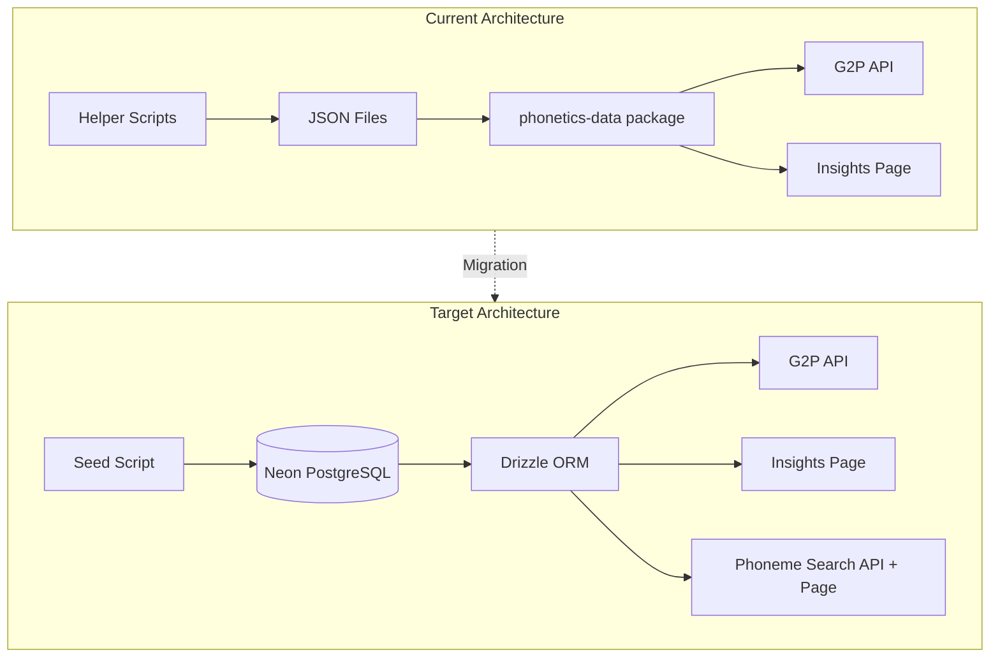
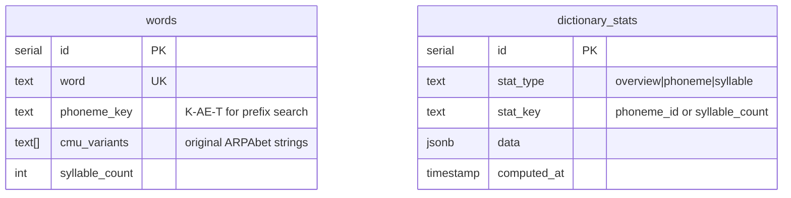

# Neon Database Migration Plan

## Architecture Overview




## Database Schema



---

## Phase 1: Database Infrastructure

### User Tasks (Manual)

1. **Create Neon project** at [neon.tech](https://neon.tech)
2. **Copy connection string** from Neon dashboard
3. **Add environment variables** to `apps/web/.env.local`:
   ```javascript
                                               DATABASE_URL=postgres://...@ep-xxx.us-east-2.aws.neon.tech/neondb?sslmode=require
   ```


4. **Add to Vercel** environment variables for production

### Code Tasks

| File | Action ||------|--------|| [`apps/web/package.json`](apps/web/package.json) | Add `drizzle-orm`, `@neondatabase/serverless`, `drizzle-kit` || `apps/web/src/db/index.ts` | NEW: Database client setup || `apps/web/src/db/schema.ts` | NEW: Drizzle schema definitions || `apps/web/drizzle.config.ts` | NEW: Drizzle Kit configuration |---

## Phase 2: Schema and Migrations

Create the Drizzle schema with two tables:**`words` table** - Main dictionary:

- `word` unique index for G2P lookups
- `phoneme_key` index for prefix search (phoneme-to-word)
- `syllable_count` for stats

**`dictionary_stats` table** - Pre-computed statistics:

- Overview stats (word count, variant count, multi-pronunciation %)
- Phoneme frequency stats (token count, word coverage, avg per word)
- Syllable distribution stats

Run `bun drizzle-kit push` to apply schema to Neon.---

## Phase 3: Seed Script

| File | Action ||------|--------|| `apps/web/src/db/seed.ts` | NEW: Seed script that fetches CMUDict, processes entries, computes stats, and inserts into DB || [`apps/web/package.json`](apps/web/package.json) | Add `"db:seed": "bun run src/db/seed.ts"` script |The seed script will:

1. Fetch CMUDict from source URL (same as helper-scripts)
2. Parse and normalize entries
3. For each word: compute `phoneme_key`, `syllable_count`
4. Batch insert into `words` table
5. Run aggregation queries to compute stats
6. Insert pre-computed stats into `dictionary_stats`

---

## Phase 4: Migrate G2P API

| File | Action ||------|--------|| [`apps/web/src/app/api/g2p/_core/dictionary.ts`](apps/web/src/app/api/g2p/_core/dictionary.ts) | Replace JSON import with Drizzle query || [`apps/web/src/app/api/g2p/_core/dictionary.test.ts`](apps/web/src/app/api/g2p/_core/dictionary.test.ts) | Update to mock database |---

## Phase 5: Migrate Insights Page

| File | Action ||------|--------|| [`apps/web/src/app/[locale]/insights/page.tsx`](apps/web/src/app/[locale]/insights/page.tsx) | Fetch stats from DB (server component) || [`apps/web/src/app/[locale]/insights/_components/overview-cards.tsx`](apps/web/src/app/[locale]/insights/_components/overview-cards.tsx) | Accept stats as props instead of importing || [`apps/web/src/app/[locale]/insights/_components/phoneme-frequency-chart.tsx`](apps/web/src/app/[locale]/insights/_components/phoneme-frequency-chart.tsx) | Accept stats as props || [`apps/web/src/app/[locale]/insights/_components/syllable-histogram.tsx`](apps/web/src/app/[locale]/insights/_components/syllable-histogram.tsx) | Accept stats as props || Other insights components | Same pattern: props instead of direct import || [`apps/web/src/app/[locale]/(overview)/_components/stats-preview-static.tsx`](apps/web/src/app/[locale]/(overview)/_components/stats-preview-static.tsx) | Fetch from DB |---

## Phase 6: Phoneme Search Feature

### API Endpoint

| File | Action ||------|--------|| `apps/web/src/app/api/phoneme-search/route.ts` | NEW: GET endpoint with prefix query |