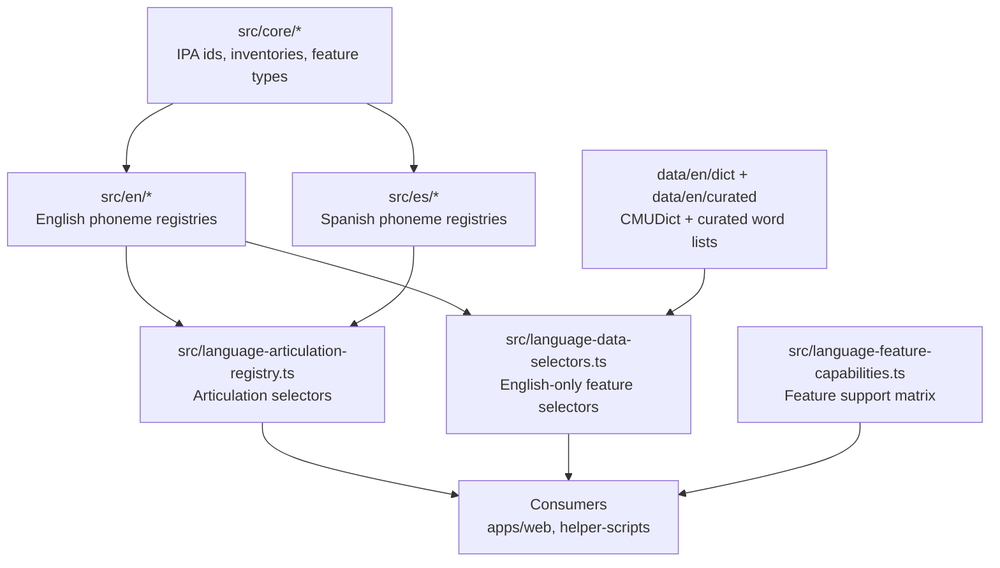

# @phonaria/phonetics-data

Language-aware phonetics data for Phonaria. The package is structured so shared IPA primitives stay stable while language-specific datasets can be added incrementally.

## Quick start

```ts
import {
  getLanguagePhonemeInventory,
  getLanguageArticulationData,
  getLanguageFeatureCapabilities,
  getSpellingPatternRegistryForLanguage,
} from "@phonaria/phonetics-data";

const language = "es" as const;

const inventory = getLanguagePhonemeInventory(language);
const articulations = getLanguageArticulationData(language);
const capabilities = getLanguageFeatureCapabilities(language);
const spellingPatterns = getSpellingPatternRegistryForLanguage(language); // null for es today
```

## Architecture model

- Core layer (`src/core/*`): language-agnostic IPA IDs, phoneme inventories, and articulatory feature types.
- Language layer (`src/en/*`, `src/es/*`): per-language registries constrained by core types.
- Selector layer (`src/language-*.ts`): typed accessors that return language data or `null` for unsupported features.
- Data assets (`data/en/*`): static dictionaries and curated lists currently available for English.



## Type-safety strategy

- `TargetLanguage` is the top-level discriminator (`"en" | "es"`).
- `LanguagePhonemeId<TLanguage>` narrows valid phoneme IDs by language at compile time.
- English-only features are explicit (`English*` naming) and gated through selectors returning `null` when unavailable for other languages.
- Capability checks (`hasLanguageFeature`, `getLanguageFeatureCapabilities`) prevent invalid assumptions in consumers.
- Shared helpers use language-specific overload-style APIs where possible instead of broad unions.

## Extension workflow (adding a language or feature)

1. Add or update inventory IDs in `src/core/language-phoneme-inventories.ts`.
2. Create language registries under `src/<language>/` and type them against core types.
3. Wire data into selector registries:
   - `src/language-articulation-registry.ts`
   - `src/language-data-selectors.ts` (only if the feature exists for that language)
4. Update `src/language-feature-capabilities.ts` for feature flags.
5. Add tests for selectors/capabilities and any new data transforms.

## Consumer guidance

- For universal views (IPA charts, articulation UI), use core + articulation selectors.
- For language-specific extras (CMU mappings, spelling patterns, contrasts, allophones), always go through selector functions and handle `null`.
- Prefer capability-first rendering:

```ts
import {
  hasLanguageFeature,
  getContrastRegistryForLanguage,
} from "@phonaria/phonetics-data";

if (hasLanguageFeature("es", "phoneme-contrasts")) {
  const contrasts = getContrastRegistryForLanguage("es");
  // consume contrasts
}
```

## Dev checklist

Run before merging package changes:

- `bun --cwd packages/phonetics-data check-types`
- `bun --cwd packages/phonetics-data test`
- `bun --cwd apps/web check-types`
- `bun --cwd packages/helper-scripts check-types`

## Current scope

- Spanish currently ships core inventory + articulatory data architecture.
- English currently provides CMU/ARPABET registries, spelling patterns, allophones, contrasts, and curated dictionary datasets.
- Selectors intentionally return `null` for not-yet-implemented language features instead of widening types with placeholder data.
