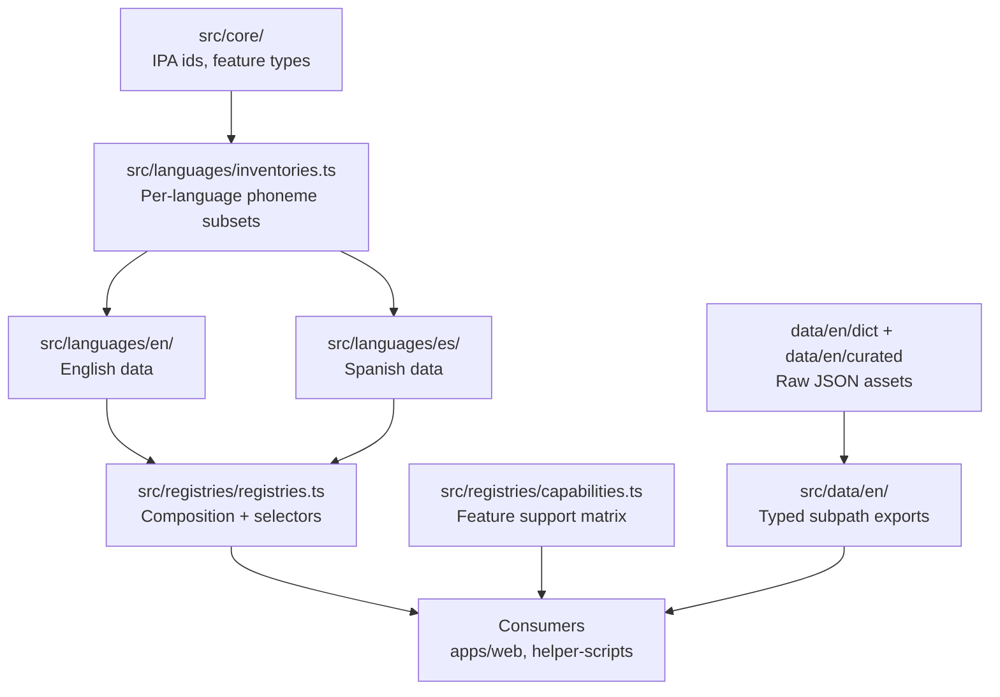

# @phonaria/phonetics-data

Language-aware phonetics data for Phonaria. The package is structured so shared IPA primitives stay stable while language-specific datasets can be added incrementally.

## Quick start

```ts
import {
  getLanguagePhonemeInventory,
  getLanguageArticulationData,
  getLanguageFeatureCapabilities,
  getSpellingPatternRegistryForLanguage,
} from "@phonaria/phonetics-data";

const language = "es" as const;

const inventory = getLanguagePhonemeInventory(language);
const articulations = getLanguageArticulationData(language);
const capabilities = getLanguageFeatureCapabilities(language);
const spellingPatterns = getSpellingPatternRegistryForLanguage(language); // null for es today
```

## Phoneme ID system

`src/core/ipa-map.ts` defines custom uppercase IDs that each map to exactly one IPA symbol. The map is the single source of truth regardless of language. IDs are extensible: when two languages need phonemically distinct sounds (e.g. English `E`=/ɛ/ vs Spanish `EE`=/e/), add a new ID rather than overriding an existing one. Existing IDs can be renamed or reorganized when it improves clarity.

## Architecture model

- Core layer (`src/core/`): language-agnostic IPA IDs and articulatory feature types.
- Languages layer (`src/languages/`): per-language data and shared language-aware types.
  - `inventories.ts`: per-language phoneme subsets (bridges core IDs to language scopes).
  - `types.ts`: generic `Language*Registry` types shared across languages.
  - `en/`, `es/`: per-language data constrained by core types.
- Registries layer (`src/registries/`): composition and app-facing API.
  - `registries.ts`: typed accessors that compose per-language data into language-indexed registries.
  - `capabilities.ts`: feature flags declaring what each language supports.
- Data layer (`src/data/en/`): typed wrapper modules that import raw JSON and expose subpath exports (e.g., `@phonaria/phonetics-data/data/en/curated-1k`). Consumers import from these modules instead of the barrel to avoid pulling unrelated JSON into their bundles.
- Data assets (`data/en/`): static dictionaries and curated lists currently available for English.



## Naming conventions

- **"Registry"** suffix is reserved for the composition layer: constants that map `TargetLanguage` to data (e.g., `LanguageArticulationRegistry`).
- **"Map"** suffix is used for static lookup objects in core and language modules (e.g., `PhonemeIpaMap`, `CmuArpaMap`).
- **Plain descriptive nouns** are used for per-language data (e.g., `EnglishConsonantArticulations`, `EnglishPhonemeAllophones`).

## Type-safety strategy

- `TargetLanguage` is the top-level discriminator (`"en" | "es"`).
- `LanguagePhonemeId<TLanguage>` narrows valid phoneme IDs by language at compile time.
- English-only features are explicit (`English*` naming) and gated through selectors returning `null` when unavailable for other languages.
- Selector return types use indexed access on `as const satisfies` registries, so TypeScript resolves the exact type per language without casts.
- Capability checks (`hasLanguageFeature`, `getLanguageFeatureCapabilities`) prevent invalid assumptions in consumers.

## Extension workflow (adding a language or feature)

1. Add or update inventory IDs in `src/languages/inventories.ts`.
2. Create language data under `src/languages/<language>/` and type it against core types.
3. Register data in `src/registries/registries.ts` (add the new entry to the relevant per-feature registry).
4. Update `src/registries/capabilities.ts` for feature flags.
5. Add tests for selectors/capabilities and any new data transforms.

## Consumer guidance

- For universal views (IPA charts, articulation UI), use core + articulation selectors.
- For language-specific extras (CMU mappings, spelling patterns, contrasts, allophones), always go through selector functions and handle `null`.
- Prefer capability-first rendering:

```ts
import {
  hasLanguageFeature,
  getContrastRegistryForLanguage,
} from "@phonaria/phonetics-data";

if (hasLanguageFeature("es", "contrasts")) {
  const contrasts = getContrastRegistryForLanguage("es");
  // consume contrasts
}
```

## Dev checklist

Run before merging package changes:

- `bun --cwd packages/phonetics-data check-types`
- `bun --cwd packages/phonetics-data test`
- `bun --cwd apps/web check-types`
- `bun --cwd packages/helper-scripts check-types`

## Current scope

- Spanish currently ships core inventory + articulatory data.
- English currently provides CMU/ARPABET mappings, spelling patterns, allophones, contrasts, and curated dictionary datasets.
- Selectors return `null` for not-yet-implemented language features instead of widening types with placeholder data.
