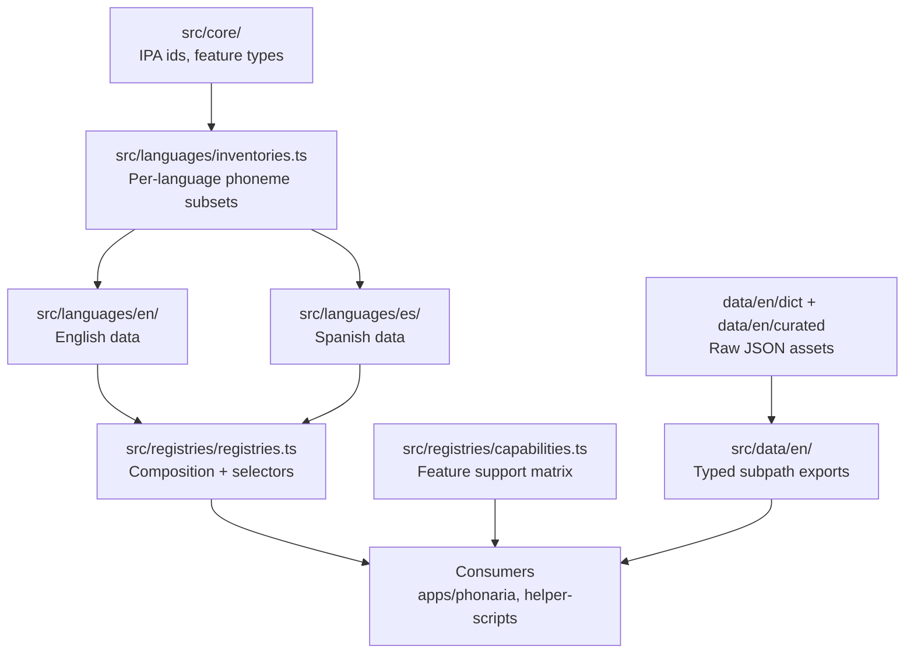

# @phonaria/phonetics-data

Language-aware phonetics data for Phonaria. The package is structured so shared IPA primitives stay stable while language-specific datasets can be added incrementally.

## Quick start

```ts
import {
  getLanguagePhonemeInventory,
  getLanguageArticulationData,
  getLanguageFeatureCapabilities,
  getSpellingPatternRegistryForLanguage,
} from "@phonaria/phonetics-data";

const language = "es-419" as const;

const inventory = getLanguagePhonemeInventory(language);
const articulations = getLanguageArticulationData(language);
const capabilities = getLanguageFeatureCapabilities(language);
const spellingPatterns = getSpellingPatternRegistryForLanguage(language); // null for es today
```

## Phoneme ID system

`src/core/ipa-map.ts` defines custom uppercase IDs that each map to exactly one IPA symbol. The map is the single source of truth regardless of language. IDs are extensible: when two languages need phonemically distinct sounds (e.g. English `E`=/ɛ/ vs Spanish `EE`=/e/), add a new ID rather than overriding an existing one. Existing IDs can be renamed or reorganized when it improves clarity.

## Architecture model

- Core layer (`src/core/`): language-agnostic IPA IDs and articulatory feature types.
- Languages layer (`src/languages/`): per-language data and shared language-aware types.
  - `inventories.ts`: per-language phoneme subsets (bridges core IDs to language scopes).
  - `types.ts`: generic `Language*Registry` types shared across languages.
  - `en/`, `es/`: per-language data constrained by core types.
- Registries layer (`src/registries/`): composition and app-facing API.
  - `registries.ts`: typed accessors that compose per-language data into language-indexed registries.
  - `capabilities.ts`: feature flags declaring what each language supports.
- Data layer (`src/data/en/`): typed wrapper modules that import raw JSON and expose subpath exports (e.g., `@phonaria/phonetics-data/data/en/curated-1k`). Consumers import from these modules instead of the barrel to avoid pulling unrelated JSON into their bundles.
- Data assets (`data/en/`): static dictionaries and curated lists currently available for English.


```mermaid
graph TD
  A["src/core/\nIPA ids, feature types"] --> B["src/languages/inventories.ts\nPer-language phoneme subsets"]
  B --> C["src/languages/en/\nEnglish data"]
  B --> D["src/languages/es/\nSpanish data"]
  C --> E["src/registries/registries.ts\nComposition + selectors"]
  D --> E
  E --> F["Consumers\napps/phonaria, helper-scripts"]
  G["src/registries/capabilities.ts\nFeature support matrix"] --> F
  H["data/en/dict + data/en/curated\nRaw JSON assets"] --> I["src/data/en/\nTyped subpath exports"]
  I --> F
```

## Naming conventions

- **"Registry"** suffix is reserved for the composition layer: constants that map `TargetAccent` to data (e.g., `LanguageArticulationRegistry`).
- **"Map"** suffix is used for static lookup objects in core and language modules (e.g., `PhonemeIpaMap`, `CmuArpaMap`).
- **Plain descriptive nouns** are used for per-language data (e.g., `EnglishConsonantArticulations`, `EnglishPhonemeAllophones`).

## Type-safety strategy

- `TargetAccent` is the top-level discriminator (`"en-us" | "es-419"`).
- `LanguagePhonemeId<TLanguage>` narrows valid phoneme IDs by language at compile time.
- English-only features are explicit (`English*` naming) and gated through selectors returning `null` when unavailable for other languages.
- Selector return types use indexed access on `as const satisfies` registries, so TypeScript resolves the exact type per language without casts.
- Capability checks (`hasLanguageFeature`, `getLanguageFeatureCapabilities`) prevent invalid assumptions in consumers.

## Extension workflow (adding a language or feature)

1. Add or update inventory IDs in `src/languages/inventories.ts`.
2. Create language data under `src/languages/<language>/` and type it against core types.
3. Register data in `src/registries/registries.ts` (add the new entry to the relevant per-feature registry).
4. Update `src/registries/capabilities.ts` for feature flags.
5. Add tests for selectors/capabilities and any new data transforms.

## Consumer guidance

- For universal views (IPA charts, articulation UI), use core + articulation selectors.
- For language-specific extras (CMU mappings, spelling patterns, contrasts, allophones), always go through selector functions and handle `null`.
- Prefer capability-first rendering:

```ts
import {
  hasLanguageFeature,
  getContrastRegistryForLanguage,
} from "@phonaria/phonetics-data";

if (hasLanguageFeature("es-419", "contrasts")) {
  const contrasts = getContrastRegistryForLanguage("es-419");
  // consume contrasts
}
```

## Dev checklist

Run before merging package changes:

- `bun run --cwd packages/phonetics-data check-types`
- `bun run --cwd packages/phonetics-data test`
- `bun run --cwd apps/phonaria check-types`
- `bun run --cwd packages/helper-scripts check-types`

## Current scope

- Spanish currently ships core inventory + articulatory data.
- English currently provides CMU/ARPABET mappings, spelling patterns, allophones, contrasts, and curated dictionary datasets.
- Selectors return `null` for not-yet-implemented language features instead of widening types with placeholder data.

Inventories, counts, capabilities, and feature registries returned by selectors
are shared readonly data, including nested records and arrays. They and their
backing language data are frozen once during module initialization. Mutation
attempts cannot change later callers' results and throw in strict mode. Make a
copy (for example, `structuredClone(data)`) before editing; copy an array before
sorting it. Helpers that build fresh results, such as
`buildFeatureValueByPhoneme`, still return independently owned data.

## Testing

Run `bun run --cwd packages/phonetics-data test` for the runtime suite and
`bun run --cwd packages/phonetics-data check-types` for public API type contracts
in `src/public-api.test-d.ts`. Both commands run in the existing workspace CI.

The tests cover inventory membership and classification, accent-specific
articulations and feature indexes, feature availability, CMU conversion and
minimal-pair helpers, and the real generated datasets. Dataset checks scan every
dictionary pronunciation, compare both curated tiers with their source, recompute
dictionary statistics, and check that teaching examples contain their advertised
sounds. These are consistency checks, not a substitute for linguistic review.

Inherited-property regression tests ensure token validation rejects object
prototype keys, including when they carry stress suffixes. Related sound guards
and pronunciation conversions are also covered.

The whitespace regression in `toBasePhonemeIds` is a passing test. All
pronunciation string consumers split on whitespace consistently, including tabs,
newlines, repeated spaces, and surrounding whitespace.

## Pronunciation parsing contracts

Raw CMU notation and stored Phonaria IDs are different formats. Raw
`HH AH0 L OW1` becomes stored `H AX0 L OU1`. Both use uppercase tokens;
consonants have no stress suffix and vowels require exactly one `0`, `1`, or `2`.
In the stored English format, schwa is only `AX0` and strut is `AH1` or `AH2`.
The parsers validate tokens, not linguistic word structure: consonant-only
sequences and multiple primary stresses are allowed.

| API | Contract |
| --- | --- |
| `tokenizePronunciation` | Split either notation on whitespace; empty input yields `[]`. No validation. |
| `parseCmuPronunciation` | Validate raw CMU tokens; return tokens or throw for empty input or any invalid token. |
| `cmuArpaVariantToPhonemeVariant` | Convert validated raw CMU to stored IDs, preserving sounds and stress. |
| `parsePhonemePronunciation` | Validate stored English tokens and stress; return tokens or throw. |
| `isValidEnglishPhonemeToken` | Check one stored English token, including stress rules. |
| `phonemeVariantToCmuArpa` | Convert validated stored English IDs to raw CMU, preserving sounds and stress. |
| `phonemeVariantToIpa` | Render validated stored English IDs; strict by default, without IPA stress marks. |
| `tryExtractBasePhonemeId` / `extractBasePhonemeId` | Recognize any core ID after removing at most one optional `0/1/2` suffix. Do not validate pronunciation stress or English membership. |
| `toBasePhonemeIds` / `getSinglePronunciation` | Compare internal sound sequences independently of stress validity. Empty pronunciations and unknown IDs throw; an empty variant list returns `null`. |

Base-ID extraction can recognize `P1`, `AX1`, bare `I`, or Spanish `EE1` even
though each is invalid in a stored English pronunciation. The legacy
`isValidPhonemeToken` predicate also only recognizes base IDs; use the explicit
English validator for full token validation.

For intentional tolerant display conversion, call
`phonemeVariantToIpa(variant, { mode: "tolerant" })`. This recognizes all core
IDs with optional stress, ignores stress validity, skips unknown tokens, and
returns `""` for empty input. The deprecated `cmuVariantToIpa` wrapper preserves
that behavior for existing callers; despite its name, it consumes internal IDs,
not raw CMU. Generators use strict conversion so invalid input cannot silently
shorten a pronunciation.
